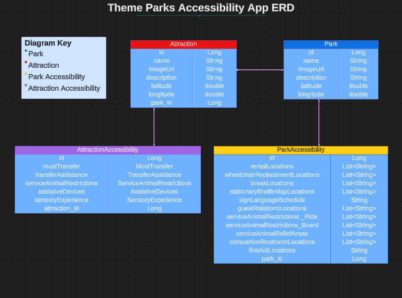

# Theme Parks Accessibility API 

The Theme Parks Accessibility API is the back-end component of a full-stack web application designed to provide detailed information related to theme parks, attractions, and accessibility features. It aims to assist visitors with disabilities or special needs in accessing detailed park and attraction information, including general accessibility details, interactive maps, and attraction descriptions. Future updates aim to enhance the park experience by offering personalized accessibility guides and resources. 


## Features (Current and Planned)

### Current Features

* Park Information: Users can view a list of all parks and get details of a specific park.
* Interactive Park Maps: Users can view an interactive map for each park to visualize its layout.
* Attraction Information: Users can view attractions in a specific park and get details of a specific attraction.
* Accessibility Information: Users can view general accessibility information for each park and detailed accessibility details for attractions.


### Planned Features

- **User Authentication**: Implement user registration and login for users to access full CRUD capabilities for managing their park plans.
- **CRUD Operations for Park Plans**: Allow users to create, view, update, and delete park plans or routes within their profile.
- **Route Optimization**: Implement a feature to calculate and create routes with the shortest distance between attractions in a park plan.
- **Break Areas Suggestion**: Include suggestions for break areas along the route to accommodate users with mobility issues who may need rest stops.


## Technologies Used 

* <b>Java 17</b>: The programming language used for the API's development, its strong object-oriented principles power the API's robust design and maintainability.
* <b>Maven</b>: The build and project management tool used to streamline the build process. It handles project dependencies, compiles the source code, and manages tasks such as packaging and deployment. 
* <b>Spring Boot</b>: The core framework that streamlines the setup and configuration of Spring-based projects, making it easier to create RESTful services and web applications. 
* <b>Spring Web</b>: Module for handling web requests. 
* <b>Spring Data (JPA)</b>: An integral part of the Spring ecosystem used in combination with Java Persistence API (JPA), it makes it easier to interact with your data source and perform database operations while reducing the amount of boilerplate code. 
* <b>MockMVC</b>: A part of the Spring Framework that allows you to perform unit and integration testing on your Spring web application. Its capability to simulate HTTP requests and responses make it essential for testing your API's endpoints.
* <b>JUnit</b>: The primary testing framework for writing unit tests and ensuring that your code functions correctly and reliably. 
* <b>H2 Database</b>: A lightweight and in-memory database engine utilized for local development and testing. 
* <b>PostgreSQL</b>: A Relational Database Management System for production deployments. 
* <b>Postman</b>: Used to make API requests, test endpoints, and inspect responses, helping with debugging and validation. 
* <b>Apache Tomcat</b>: Used as the web server or servlet container to deploy and run your Spring Boot application. It serves as the environment where your API can be accessed and utilized. 
* <b>IntelliJ</b>: A popular Integrated Development Environment (IDE) for Java development that provides a powerful and user-friendly environment for coding, debugging, and managing your Spring Boot project. 


## Entity Relationship Diagram




## Getting Started

### Prerequisites
* Java Development Kit (JDK) 8 or higher
* IntelliJ IDEA or Eclipse IDE (recommended for Java development)
* Git (optional but recommended for version control)


### Dependencies

To run this REST API project, you will need to install the following dependencies and tools. This project is built using Java 17, Spring 3.2.5, and utilizes several Spring Boot Starter packages, H2 Database, Spring Data JPA, Spring Web, Spring Boot Dev Tools, and JUnit for testing. Maven is used as the build tool, and the Maven Surefire plugin helps manage project dependencies and testing.

#### Java 17

Make sure you have Java 17 or a compatible version installed on your system. You can download and install Java 17 from the official Oracle website or use an OpenJDK distribution.

#### Maven

This project uses Apache Maven as the build tool. If you don't have Maven installed, you can download it from the official Apache Maven website: [Download Maven](https://maven.apache.org/download.cgi)

#### Spring Framework

Spring Boot 3.2.5 is the core framework for this project. It includes Spring Data JPA, Spring Web, and Spring Boot Dev Tools. You don't need to install these components separately, as they are managed by Spring Boot.

#### H2 Database

H2 Database is used for local development and testing. It is automatically included as a dependency, so you don't need to install it separately.

#### JUnit

JUnit is used for unit testing in this project. It is included as a dependency and will be used for testing your code.

#### Spring Boot Starter Test

Spring Boot Starter Test is used to enable testing in a Spring Boot application. It's included as a dependency in this project.

#### Maven Surefire Plugin

Maven Surefire Plugin is used to manage dependencies and run tests. You don't need to install it separately; it's configured in the project's pom.xml file.


### Installation
1. Clone the repository to your local machine:
   ```bash
   git clone https://github.com/AyalaVirtual/ThemeParksAccessibilityAPI.git 

2. **Backend Setup:** 
   - Open the project in your IDE (IntelliJ IDEA or Eclipse). 
   - Navigate to the project directory.

3. **Install Dependencies:**
   - Install dependencies for the backend modules. 
   - Ensure you have Java Development Kit (JDK) 8 or higher installed.

4. **Set up PostgreSQL:**
   - Install PostgreSQL on your machine if you haven't already.
   - Create a database for the project (e.g., themeparksaccessibility).
   - Update the database configurations in application.properties under src/main/resources in the backend module:
     ```properties
     spring.datasource.url=jdbc:postgresql://localhost:5432/themeparksaccessibility 
     spring.datasource.username=your_username
     spring.datasource.password=your_password
     ```


5. **Build and Run the Spring Boot Application:**
   - Build and run the Spring Boot application (`ThemeParksAccessibilityApplication`).

6. **Start the Application:**
    - Once the application is running, the backend API endpoints will be available at `http://localhost:8080`. 

7. **Frontend Setup:**
   - Follow the instructions in the frontend repository to set up and run the frontend application.

8. **Accessing the Application:**
    - Once the backend is running, you can access the application through the provided frontend interface or API endpoints as needed.


## HTTP Endpoints

| Request Type | URL                                                                                                   | Functionality                                                                     | Access |
|--------------|-------------------------------------------------------------------------------------------------------|-----------------------------------------------------------------------------------|--------|
| GET          | `/api/parks/`                                                                                         | Get a map and a list of all parks.                                                | Public |
| GET          | `/api/parks/{parkId}/parkaccessibility/{parkAccessibilityId}/`                                        | Get accessibility information and a map for a specific park.                      | Public |
| GET          | `/api/parks/{parkId}/attractions/`                                                                    | Get a list of all attractions and a map for a specific park.                      | Public |
| GET          | `/api/parks/{parkId}/attractions/{attractionId}/attractionaccessibility/{attractionAccessibilityId}/` | Get information about a specific attraction along with its accessibility details. | Public |


## Links
* User Stories - https://docs.google.com/document/d/1mLiORi0NO0TcaMykAujzYsgFoyzLBELlFtPALw_Yj3c/edit?usp=sharing 

* HTTP requests/endpoints spreadsheet - https://docs.google.com/spreadsheets/d/1xIWKhaml3FHhzpcYROyoGMMztVnEql5rJnGOybD2k2M/edit?usp=sharing 


## Authors

:woman_technologist: Erica Ayala

* [LinkedIn](https://www.linkedin.com/in/ayalavirtual)

* [GitHub](https://www.github.com/AyalaVirtual)


