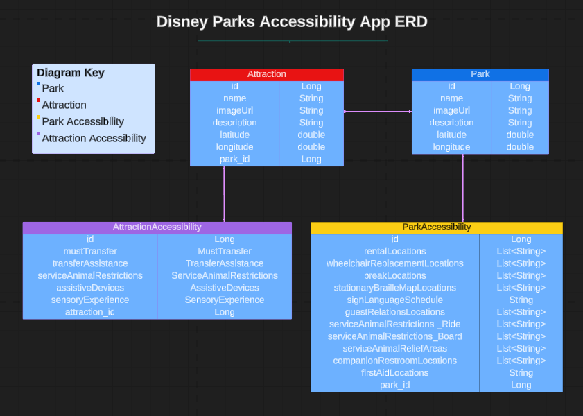

# Disney Parks Accessibility API 

The Disney Parks Accessibility API is the back-end component of a full-stack web application designed to provide detailed information related to Disney World parks, attractions, and accessibility features. It aims to assist visitors with disabilities or special needs in accessing detailed park and attraction information, including general accessibility details, interactive maps, and attraction descriptions. Future updates aim to enhance the park experience by offering personalized accessibility guides and resources. 


## Features (Current and Planned)

### Current Features

* Park Information: Users can view a list of all parks and get details of a specific park.
* Interactive Park Maps: Users can view an interactive map for each park to visualize its layout.
* Attraction Information: Users can view attractions in a specific park and get details of a specific attraction.
* Accessibility Information: Users can view general accessibility information for each park and detailed accessibility details for attractions.


### Planned Features

- **User Authentication**: Implement user registration and login for users to access full CRUD capabilities for managing their park plans.
- **CRUD Operations for Park Plans**: Allow users to create, view, update, and delete park plans or routes within their profile.
- **Route Optimization**: Implement a feature to calculate and create routes with the shortest distance between attractions in a park plan.
- **Break Areas Suggestion**: Include suggestions for break areas along the route to accommodate users with mobility issues who may need rest stops.


## Technologies Used 

* Java 17 
* Maven 
* Spring Boot (Backend framework for RESTful APIs)
* Spring Data JPA (Data access layer for interacting with databases)
* H2 Database (In-memory database for development)
* Spring Web (Module for handling web requests)
* Postman
* Apache Tomcat
* IntelliJ 


## Entity Relationship Diagram




## Getting Started

### Prerequisites
* Java Development Kit (JDK) 8 or higher
* IntelliJ IDEA or Eclipse IDE (recommended for Java development)
* Git (optional but recommended for version control)


### Installation
1. Clone the repository to your local machine:
   ```bash
   git clone https://github.com/your-username/disney-parks-accessibility.git

2. **Backend Setup:** 
   - Open the project in your IDE (IntelliJ IDEA or Eclipse). 
   - Navigate to the project directory.

3. **Install Dependencies:**
   - Install dependencies for both the backend modules.

4. **Build and Run the Spring Boot Application:**
   - Build and run the Spring Boot application (`DisneyParksAccessibilityApplication`).

5. **Database Configuration (H2 Database):**
    - The project is configured to use an H2 in-memory database for development.
    - Database configurations can be found in `application.properties` under `src/main/resources` in the backend module.

6. **Start the Application:**
    - Once the application is running, the backend API endpoints will be available at `http://localhost:8080`. 

7. **Frontend Setup:**
   - Follow the instructions in the frontend repository to set up and run the frontend application.

8. **Accessing the Application:**
    - Once the backend is running, you can access the application through the provided frontend interface or API endpoints as needed.


## Usage
1. Open your web browser and navigate to `http://localhost:3000` to access the application.
2. Explore parks, attractions, and accessibility information using the provided interfaces.
3. Interact with the frontend components to view detailed attraction information and accessibility details.


## HTTP Endpoints

| Request Type | URL                                                                               | Functionality                                                    | Access |
|--------------|-----------------------------------------------------------------------------------|------------------------------------------------------------------|--------|
| GET          | `/api/parks/`                                                                     | Get a list of all parks.                                         | Public |
| GET          | `/api/parks/{parkId}/`                                                            | Get details of a specific park by ID.                            | Public |
| GET          | `/api/parks/{parkId}/accessibility/{accessibilityId}/` | Get accessibility information for an attraction.                 | Public |
| GET          | `/api/parks/{parkId}/attractions/`                                                | Get a list of all attractions in a specific park.                | Public |
| GET          | `/api/parks/{parkId}/attractions/{attractionId}/`                                 | Get details of a specific attraction.                            | Public |


## Links
* User Stories - https://docs.google.com/document/d/1mLiORi0NO0TcaMykAujzYsgFoyzLBELlFtPALw_Yj3c/edit?usp=sharing 

* HTTP requests/endpoints spreadsheet - https://docs.google.com/spreadsheets/d/1xIWKhaml3FHhzpcYROyoGMMztVnEql5rJnGOybD2k2M/edit?usp=sharing 


## Authors

:woman_technologist: Erica Ayala

* [LinkedIn](https://www.linkedin.com/in/ayalavirtual)

* [GitHub](https://www.github.com/AyalaVirtual)


## License

This project is licensed under the MIT License - see the [LICENSE.md](link-to-license-file) file for details. 


